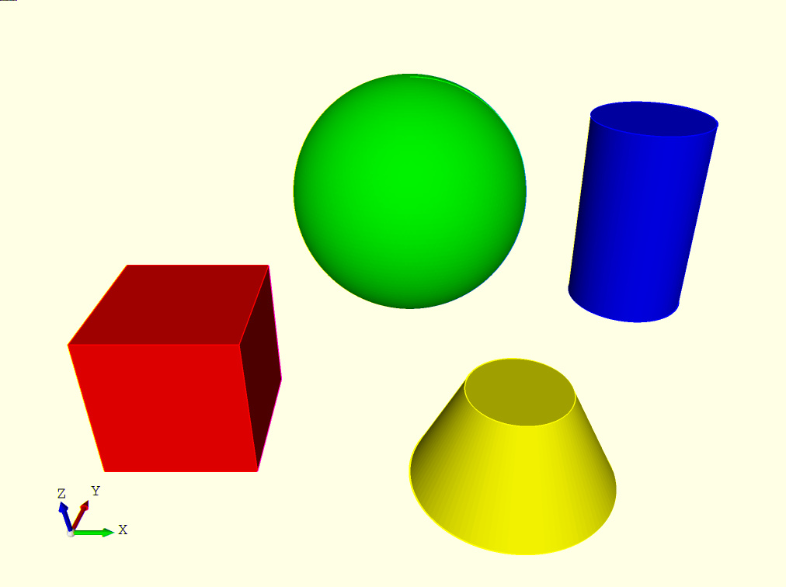
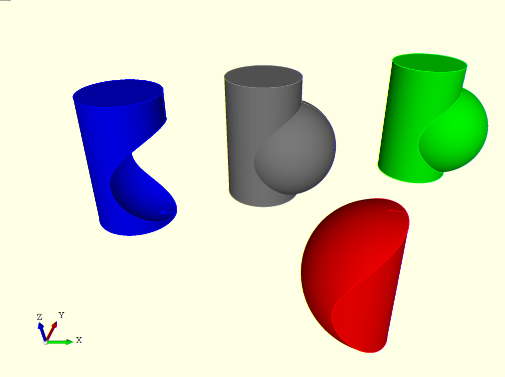
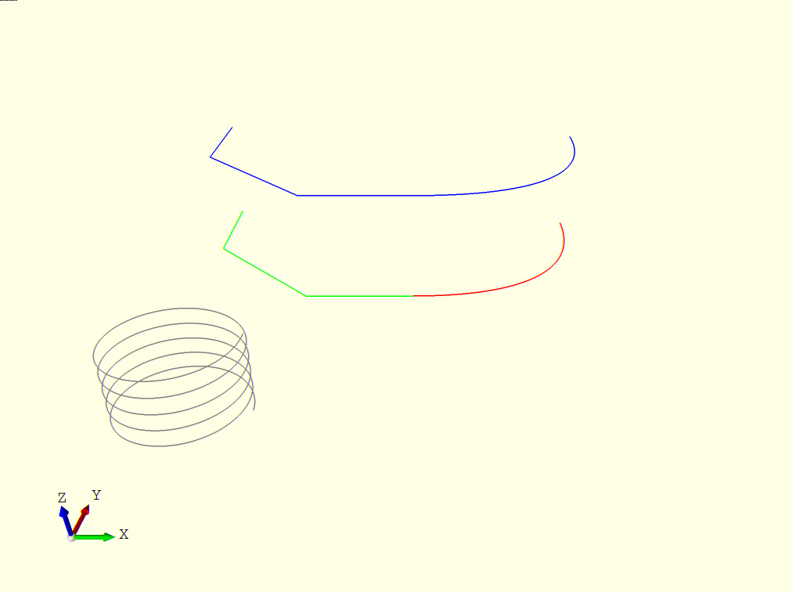

# Examples

## Simple 3d objects



```python
import PyCad

sphere=PyCad.gen.sphere(r=3).translate(0, 0, 3)
cube=PyCad.gen.cube(3, 3, 3).translate(-6, -7, 0)
cylinder=PyCad.gen.cylinder(d=3, h=5).translate(6, 0, 0)
cone=PyCad.gen.cone(r1=2, r2=1, h=2).translate(2, -7, 0)

sphere.setColor(PyCad.colors.red)
cube.setColor(PyCad.colors.green)
cylinder.setColor(PyCad.colors.blue)
cone.setColor(PyCad.colors.yellow)

result=[sphere, cube, cylinder, cone]

```


## Boolean operations with solids



```python
import PyCad

sphere=PyCad.gen.sphere(r=2).translate(1, 0, 2)
cylinder=PyCad.gen.cylinder(d=3, h=5)

fuse=PyCad.op.fuse(sphere, cylinder)
fuse.translate(7, 2, 0)
fuse.setColor(PyCad.colors.red)

cut=PyCad.op.cut(cylinder, sphere)
cut.translate(-5, -2, 0)
cut.setColor(PyCad.colors.blue)

common=PyCad.op.common(cylinder, sphere)
common.translate(2, -8, 0)
common.setColor(PyCad.colors.green)

result=[sphere, cylinder, fuse, cut, common]

```


## Lines 



```python
import PyCad

line=PyCad.gen.line_3d([
	PyCad.Vec3(0, 0, 0), 
	PyCad.Vec3(-3, 0, 0), 
	PyCad.Vec3(-6, 3, 0), 
	PyCad.Vec3(-6, 6, 0)])
line.setColor(PyCad.colors.red)

bezier=PyCad.gen.bezier_3d([
	PyCad.Vec3(0, 0, 0), 
	PyCad.Vec3(5, 0, 0), 
	PyCad.Vec3(5, 5, 0)])
bezier.setColor(PyCad.colors.green)

fuse=PyCad.op.fuse(line, bezier)
fuse.setColor(PyCad.colors.blue)
fuse.translate(0, 0, 3)

helix=PyCad.gen.helix(d=3, revolutions=5, ascend=0.4)
helix.translate(-5, -5, 0)

result=[line, bezier, fuse, helix]

```


